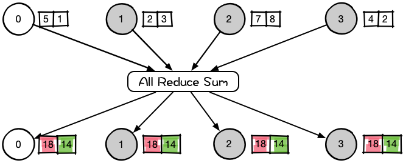
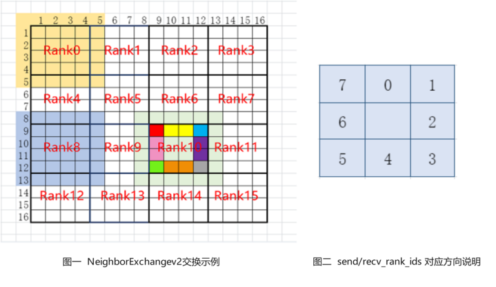

# 分布式训练通信原语

<a href="https://gitee.com/mindspore/docs/blob/tutorials-develop/tutorials/experts/parallel/source_zh_cn/communication_primitive.md" target="_blank"></a>

当将神经网络的训练并行化到集群中不同的节点时，必须选择如何将不同的计算操作分配到集群中可用的节点，这就离不开对分布式集群的通信进行操作。

分布式通信中包含多个sender和多个receiver，一般的通信原语操作包括Broadcast、Gather、All Gather、Scatter、Reduce、All-reduce、Reduce Scatter、All to All等，用于操作通信中的数据传输，本节将会分别介绍其具体含义和示例代码。

下述每个章节中给出了使用4张GPU进行不同通信操作的示例，示例中的输出来自于节点0`rank0`程序的结果。

> 用户需要将下述每个章节代码另存为communication.py执行。

## 通信原语操作

### Broadcast

在集合通信中，如果某个节点想把自身的数据发送到集群中的其他节点，那么就可以使用广播Broadcast的操作。

如图所示，圆圈表示分布式系统中的独立节点，一共4个节点，小方块则代表了数据，颜色相同表示数据一样，默认设置节点0为主节点（白色），其余节点为灰色。Broadcast代表广播行为，执行Broadcast时，数据从主节点0广播至其他各个指定的节点（0~3）。


Broadcast操作是将某节点的输入广播到其他节点上，分布式机器学习中常用于网络参数的初始化。如图中，从单个sender数据发送到其他节点上，将节点0大小为1xN的Tensor进行广播，最终每个节点输出均为[1xN]的矩阵。


示例代码如下：我们将`Broadcast`算子的根节点设置为0号节点，表示将从0号节点广播数据到其他节点上。同时申请了一个1x1大小，数值为0的输入。然后调用`Broadcast`算子，在通信域为`0-1-2-3`的节点中进行通信，最终每个节点的输出数值来自节点0。

```python
from mindspore import Tensor
from mindspore import context
from mindspore.communication import init
import mindspore.nn as nn
import mindspore.ops as ops
import numpy as np

context.set_context(mode=context.GRAPH_MODE)
init()
class Net(nn.Cell):
    def __init__(self):
        super(Net, self).__init__()
        self.broadcast = ops.Broadcast(0)

    def construct(self, x):
        return self.broadcast((x,))

input_x = Tensor(np.array([[0]]).astype(np.int32))
net = Net()
output = net(input_x)
print(output)
```

运行结果如下，输出日志路径为`log/1/rank.0`：

```text
[[0]]
```

### Reduce

Reduce称为规约运算，是一系列简单运算操作的统称，细分可以包括：SUM、MIN、MAX、PROD、LOR等类型的规约操作。Reduce意为减少/精简，因为其操作在每个节点上获取一个输入元素数组，通过执行操作后，将得到精简的更少的元素。下面以Reduce sum为例子。


在NCCL中的Reduce，从多个sender那里接收数据，最终合并到一个节点上。


### All Reduce

Reduce是一系列简单运算操作的统称，All Reduce则是在所有的节点上都应用同样的Reduce操作。以All Reduce Sum为例。



All Reduce操作可通过单节点上Reduce + Broadcast操作完成。在NCCL中的All Reduce中，则是从多个sender那里接收数据，最终合并和分发到每一个节点上。


All Reduce操作会将每个节点中`AllReduce`算子的输入Tensor进行求和操作，最终每个节点的`AllReduce`算子输出是相同的数值。例如，每个节点`AllReduce`算子输入分别为`0, 1, 2, 3`。经过All Reduce操作之后，每个节点输出的结果为所有节点输入之和为$6=0+1+2+3$。

示例代码如下：根据rank ID(每个节点所属通信编号)初始化每个进程中`AllReduce`算子输入的数值，例如节点0，申请一个1x1大小，数值为0的输入。然后调用`AllReduce`算子，在通信域为`0-1-2-3`的节点中进行通信，并且打印输出结果。

```python
import numpy as np
from mindspore.communication import init, get_rank
from mindspore import Tensor
import mindspore.nn as nn
import mindspore.ops as ops

init()
class Net(nn.Cell):
    def __init__(self):
        super(Net, self).__init__()
        self.all_reduce_sum = ops.AllReduce(ops.ReduceOp.SUM, group="nccl_world_group")

    def construct(self, x):
        return self.all_reduce_sum(x)

value = get_rank()
input_x = Tensor(np.array([[value]]).astype(np.float32))
net = Net()
output = net(input_x)
print(output)
```

其中节点0的运行结果如下，输出日志路径为`log/1/rank.0`：

```text
[[6.]]
```

### Gather

Gather操作将多个sender上的数据收集到单个节点上。


Gather操作会从多个节点里面收集数据到一个节点上面，而不是从一个节点分发数据到多个节点。这个机制对很多平行算法很有用，比如并行的排序和搜索。


### All Gather

很多时候发送多个元素到多个节点也很有用，即在多对多通信模式的场景。这个时候就需要 All Gather操作。


对于分发在所有节点上的一组数据来说，All Gather会收集所有数据到所有节点上。从最基础的角度来看，All Gather相当于一个Gather操作之后跟着一个Broadcast操作。下面的示意图显示了All Gather调用之后数据是如何分布的。


All Gather操作会将每个节点的输入Tensor的第0维度上进行拼接，最终每个节点输出是相同的数值。例如，每个节点的输入是大小为1x1的Tensor，经过All Gather操作之后，每个节点`AllGather`算子的输出shape为[4,1]。其中索引为[0,0]的元素值来自于节点0`AllGather`算子的输入[[0.0]]，索引为[1,0]的元素值来自于节点1`AllGather`算子的输入[[1.0]]。

示例代码如下：我们根据rank ID初始化每个进程中`AllGather`算子输入的数值，例如节点0，我们申请了一个1x1大小，数值为0的输入。然后调用`AllGather`算子，在通信域为`0-1-2-3`的节点中进行通信，并且打印输出结果。

```python
import numpy as np
import mindspore.ops as ops
import mindspore.nn as nn
from mindspore.communication import init, get_rank
from mindspore import Tensor, context

context.set_context(mode=context.GRAPH_MODE)
init()

class Net(nn.Cell):
    def __init__(self):
        super(Net, self).__init__()
        self.all_gather = ops.AllGather()

    def construct(self, x):
        return self.all_gather(x)

value = get_rank()
input_x = Tensor(np.array([[value]]).astype(np.float32))
net = Net()
output = net(input_x)
print(output)
```

运行结果如下，输出日志路径为`log/1/rank.0`：

```text
[[0.],
 [1.],
 [2.],
 [3.]]
```

## Reduce Scatter

Reduce Scatter操作会将每个节点的输入先进行求和，然后在第0维度按节点数切分，将数据分发到对应的节点上。例如，每个节点的输入均为4x1的Tensor。`ReduceScatter`算子先对输入求和得到[0, 4, 8, 12]的Tensor，然后进行分发，每个节点获得1x1大小的Tensor。例如节点0对应的输出结果为[[0.0]]，节点1对应的输出结果为[[4.0]]。


示例代码如下：我们根据rank ID初始化每个进程中`ReduceScatter`算子输入的数值，例如节点0，我们申请了一个4x1大小，数值为0的输入。然后调用`ReduceScatter`算子，在通信域为`0-1-2-3`的节点中进行通信，并且打印输出结果。

```python
from mindspore import Tensor, context
from mindspore.communication import init, get_rank
import mindspore.nn as nn
import mindspore.ops as ops
import numpy as np

context.set_context(mode=context.GRAPH_MODE)
init()
class Net(nn.Cell):
    def __init__(self):
        super(Net, self).__init__()
        self.reduce_scatter = ops.ReduceScatter(ops.ReduceOp.SUM)

    def construct(self, x):
        return self.reduce_scatter(x)

input_x = Tensor(np.array([[0], [1], [2], [3]]).astype(np.float32))
net = Net()
output = net(input_x)
print(output)
```

运行结果如下，输出日志路径为`log/1/rank.0`：

```text
[[0.]]
```

## Neighbor Exchange


Neighbor Exchange操作会提供一组数据分别发往其它特定的节点上，同时从特定的节点接收数据。例如上图中，rank 0 向rank 1发送shape为[16,16]的Tensor， 并接收rank 1发送的shape为[32,32]的Tensor；rank 1 向rank 0发送shape为[32,32]的Tensor， 并接收rank 0发送的shape为[16,16]的Tensor。最终rank 0输出了接收到的shape为[32,32]的Tensor， rank 1输出接收到的shape为[16,16]的Tensor。

示例代码如下：我们使用`NeighborExchange`算子进行节点0和1之间的数据交换，将节点0的数据发送到节点1，并接收来自节点1的数据；节点1将数据发送到节点0，并接收来自节点0的数据；最终每个节点输出接收到的数据。

```python
import os
import mindspore as ms
from mindspore import Tensor
from mindspore import context
from mindspore.communication import init
import mindspore.nn as nn
import mindspore.ops as ops
import numpy as np

class Net0(nn.Cell):
    def __init__(self):
        super(Net0, self).__init__()
        self.neighbor_exchange = ops.NeighborExchange(send_rank_ids=[1], recv_rank_ids=[1], recv_shapes=([2, 2],), send_shapes=([3, 3],), recv_type=ms.float32)

    def construct(self, x):
        out = self.neighbor_exchange((x,))
        return out[0]

class Net1(nn.Cell):
    def __init__(self):
        super(Net1, self).__init__()
        self.neighbor_exchange = ops.NeighborExchange(send_rank_ids=[0], recv_rank_ids=[0], recv_shapes=([3, 3],), send_shapes=([2, 2],), recv_type=ms.float32)

    def construct(self, x):
        out = self.neighbor_exchange((x,))
        return out[0]

context.set_context(mode=context.GRAPH_MODE, device_target='Ascend')
init()
rank_id = int(os.getenv("RANK_ID"))
if (rank_id % 2 == 0):
    input_x = Tensor(np.ones([3, 3]), dtype = ms.float32)
    net = Net0()
    output = net(input_x)
    print(output)
else:
    input_x = Tensor(np.ones([2, 2]) * 2, dtype = ms.float32)
    net = Net1()
    output = net(input_x)
    print(output)
```

使用shell脚本启动节点2脚本，下述中的`rank_table_file`文件可以使用[models](https://gitee.com/mindspore/models)下面的hccl_tools.py生成，对应的目录文件为`models/utils/hccl_tools`。示例shell脚本如下：

```shell
export MINDSPORE_HCCL_CONFIG_PATH=rank_table_file
export DEVICE_NUM=2
BASE_PATH=$(cd "$(dirname $0)"; pwd)
for((i=0; i<$DEVICE_NUM; i++)); do
    rm -rf ${BASE_PATH}/rank${i}
    mkdir ${BASE_PATH}/rank${i}
    cp -r ${BASE_PATH}/neighborexchange.py ${BASE_PATH}/rank${i}/
    cd ${BASE_PATH}/rank${i}
    export RANK_ID=${i}
    export DEVICE_ID=${i}
    echo "start training for device $i"
    python neighborexchange.py > log.txt 2>&1 &
done
```

rank0的结果为：

```text
[[2. 2.]
 [2. 2.]]
```

rank1的结果为：

```text
[[1. 1. 1.]
 [1. 1. 1.]
 [1. 1. 1.]]
```

## Neighbor Exchange V2



Neighbor Exchange V2操作会将Tensor中按照属性设置将部分数据发送给周边的8个节点，且从周边的8个节点中接收数据并拼接成新的Tensor，常用于将大Tensor切分在多节点上进行分布式卷积运算的场景。其中，属性send_rank_ids和recv_rank_ids分别为8个数字，表示8个方向上发送/接收的rank_id，填-1表示不发送/接收，如上图图二表示对应8个方向上的顺序；属性send_lens和recv_lens分别为4个数字，表示[top, bottom, left, right] 四个方向上的发送/接收长度。例如上图图一中为一个16节点的示例， 以图中rank 10为例，设定send_rank_ids=[6,7,11,15,14,13,9,5]，将rank10的数据进行切分后分别向rank 5、6、7、11、15、14、13、9发送了对应部分的数据，例如图中红色发给rank5，红色、黄色和蓝色发给rank6，蓝色发给rank7等；设定recv_rank_ids=[6,7,11,15,14,13,9,5]，则同时rank10从这些节点分别接收了一些数据拼接到对应方向上，组成了新的Tensor输出，例如图中的rank10和浅绿色部分所示。

示例代码如下：我们使用`NeighborExchangeV2`算子进行节点0和1之间的数据交换，将节点0的下方的数据发送到节点1，并接收来自节点1的数据拼接在下方；节点1将上方部分数据发送到节点0，并接收来自节点0的数据拼接在上方；最终每个节点输出接收到的数据。

```python
import os
import mindspore as ms
from mindspore import Tensor
from mindspore import context
from mindspore.communication import init
import mindspore.nn as nn
import mindspore.ops as ops
import numpy as np

class Net0(nn.Cell):
    def __init__(self):
        super(Net0, self).__init__()
        self.neighbor_exchangev2 = ops.NeighborExchangeV2(send_rank_ids=[-1, -1, -1, -1, 1, -1, -1, -1], send_lens=[0, 1, 0, 0], recv_rank_ids=[-1, -1, -1, -1, 1, -1, -1, -1], recv_lens=[0, 1, 0, 0], data_format="NCHW")

    def construct(self, x):
        out = self.neighbor_exchangev2(x)
        return out

class Net1(nn.Cell):
    def __init__(self):
        super(Net1, self).__init__()
        self.neighbor_exchangev2 = ops.NeighborExchangeV2(send_rank_ids=[0, -1, -1, -1, -1, -1, -1, -1], send_lens=[1, 0, 0, 0], recv_rank_ids=[0, -1, -1, -1, -1, -1, -1, -1], recv_lens=[1, 0, 0, 0], data_format="NCHW")

    def construct(self, x):
        out = self.neighbor_exchangev2(x)
        return out

context.set_context(mode=context.GRAPH_MODE, device_target='Ascend')
init()
rank_id = int(os.getenv("RANK_ID"))
if (rank_id % 2 == 0):
    input_x = Tensor(np.ones([1, 1, 2, 2]), dtype = ms.float32)
    net = Net0()
    output = net(input_x)
    print(output)
else:
    input_x = Tensor(np.ones([1, 1, 2, 2]) * 2, dtype = ms.float32)
    net = Net1()
    output = net(input_x)
    print(output)
```

使用shell脚本启动2个节点脚本，下述中的`rank_table_file`文件可以使用[models](https://gitee.com/mindspore/models)下面的hccl_tools.py生成，对应的目录文件为`models/utils/hccl_tools`。示例shell脚本如下：

```shell
export MINDSPORE_HCCL_CONFIG_PATH=rank_table_file
export DEVICE_NUM=2
BASE_PATH=$(cd "$(dirname $0)"; pwd)
for((i=0; i<$DEVICE_NUM; i++)); do
    rm -rf ${BASE_PATH}/rank${i}
    mkdir ${BASE_PATH}/rank${i}
    cp -r ${BASE_PATH}/neighborexchangev2.py ${BASE_PATH}/rank${i}/
    cd ${BASE_PATH}/rank${i}
    export RANK_ID=${i}
    export DEVICE_ID=${i}
    echo "start training for device $i"
    python neighborexchangev2.py > log.txt 2>&1 &
done
```

rank 0结果为：

```text
[[[[1. 1.]
   [1. 1.]
   [2. 2.]]]]
```

rank 1结果为：

```text
[[[[1. 1.]
   [2. 2.]
   [2. 2.]]]]
```

## All to All

All to All作为全交换操作，通过All to All通信，可以让每个节点都获取其他节点的值。

在使用 All to All 时，每一个节点都会向任意一个节点发送消息，每一个节点也都会接收到任意一个节点的消息。每个节点的接收缓冲区和发送缓冲区都是一个分为若干个数据块的数组。All to All 的具体操作是：将节点i的发送缓冲区中的第j块数据发送给节点j，节点j将接收到的来自节点i的数据块放在自身接收缓冲区的第i块位置。

All to All 与 All Gather 相比较，区别在于：All Gather 操作中，不同节点向某一节点收集到的数据是完全相同的，而在 All to All 中，不同的节点向某一节点收集到的数据是不同的。在每个节点的发送缓冲区中，为每个节点都单独准备了一块数据。


示例代码如下：我们使用`AlltoAll`算子进行8个节点的数据交换，把每个节点在第-2维进行切分，并按顺序把切分的数据发送给其它节点，同时接收其它节点的数据，在-1维进行拼接；最终每个节点输出拼接后的数据。

```python
import os
import mindspore as ms
from mindspore import Tensor
from mindspore import context
from mindspore.communication import init
import mindspore.nn as nn
import mindspore.ops as ops
import numpy as np

class Net(nn.Cell):
    def __init__(self):
        super(Net, self).__init__()
        self.all_to_all = ops.AlltoAll(split_count = 8, split_dim = -2, concat_dim = -1)

    def construct(self, x):
        out = self.all_to_all(x)
        return out

context.set_context(mode=context.GRAPH_MODE, device_target='Ascend')
init()
net = Net()
rank_id = int(os.getenv("RANK_ID"))
input_x = Tensor(np.ones([1, 1, 8, 1]) * rank_id, dtype = ms.float32)
output = net(input_x)
print(output)
```

使用shell脚本启动8个节点脚本，下述中的`rank_table_file`文件可以使用[models](https://gitee.com/mindspore/models)下面的hccl_tools.py生成，对应的目录文件为`models/utils/hccl_tools`。示例shell脚本如下：

```shell
export MINDSPORE_HCCL_CONFIG_PATH=rank_table_file
export DEVICE_NUM=8
BASE_PATH=$(cd "$(dirname $0)"; pwd)
for((i=0; i<$DEVICE_NUM; i++)); do
    rm -rf ${BASE_PATH}/rank${i}
    mkdir ${BASE_PATH}/rank${i}
    cp -r ${BASE_PATH}/alltoall.py ${BASE_PATH}/rank${i}/
    cd ${BASE_PATH}/rank${i}
    export RANK_ID=${i}
    export DEVICE_ID=${i}
    echo "start training for device $i"
    python alltoall.py > log.txt 2>&1 &
done
```

rank0~rank7的结果为：

```text
[[[[0. 1. 2. 3. 4. 5. 6. 7.]]]]
```

## 安装与注意事项

### 前期安装

因为涉及到多节点程序，用户需要通过`mpirun`命令去启动communication.py。其中`mpirun`命令需要安装OpenMPI以及NCCL，对应的安装请参考[此处](https://www.mindspore.cn/docs/programming_guide/zh-CN/master/distributed_training_gpu.html)。准备好communication.py后，在命令行中输入如下启动命令，即可启动多节点程序：

```bash
mpirun -output-filename log -merge-stderr-to-stdout -np 4 python communication.py
```

上述代码中的`-np`表示将启动4个进程任务，分别占用节点0、1、2和3，并且将输出日志保存在`log/1/rank.0`目录下面，用户可以在此查看程序的输出结果。`python communication.py`表示启动脚本。

### 注意事项

在华为昇腾芯片上，NeighborExchange、NeighborExchangeV2、AlltoAll三个算子需要进行全连接配网。

全连接配网支持任意节点之间进行通信，没有数量限制。全连接配网方式可参考[HCCN Tool 接口参考](https://support.huawei.com/enterprise/zh/ascend-computing/a300t-9000-pid-250702906?category=developer-documents)进行配置。全连接配网时，所有节点需要VLan ID相同、IP在同一网段，配置到其他节点的静态路由表和ARP。其中，**VLan ID需要在交换机上进行配置**，其他IP等改动的单机8节点配置参考样例如下：

```shell
# 配置IP到同一网段
hccn_tool -i 0 -ip -s address 192.98.92.100 netmask 255.255.255.0
hccn_tool -i 1 -ip -s address 192.98.92.101 netmask 255.255.255.0
hccn_tool -i 2 -ip -s address 192.98.92.102 netmask 255.255.255.0
hccn_tool -i 3 -ip -s address 192.98.92.103 netmask 255.255.255.0
hccn_tool -i 4 -ip -s address 192.98.92.104 netmask 255.255.255.0
hccn_tool -i 5 -ip -s address 192.98.92.105 netmask 255.255.255.0
hccn_tool -i 6 -ip -s address 192.98.92.106 netmask 255.255.255.0
hccn_tool -i 7 -ip -s address 192.98.92.107 netmask 255.255.255.0

# 策略路由
hccn_tool -i 0 -ip_rule -a dir from ip 192.98.92.100 table 100
hccn_tool -i 1 -ip_rule -a dir from ip 192.98.92.101 table 101
hccn_tool -i 2 -ip_rule -a dir from ip 192.98.92.102 table 102
hccn_tool -i 3 -ip_rule -a dir from ip 192.98.92.103 table 103
hccn_tool -i 4 -ip_rule -a dir from ip 192.98.92.104 table 104
hccn_tool -i 5 -ip_rule -a dir from ip 192.98.92.105 table 105
hccn_tool -i 6 -ip_rule -a dir from ip 192.98.92.106 table 106
hccn_tool -i 7 -ip_rule -a dir from ip 192.98.92.107 table 107

hccn_tool -i 0 -ip_route -a ip 192.98.92.0 ip_mask 24 via 192.98.92.100 dev eth0 table 100
hccn_tool -i 1 -ip_route -a ip 192.98.92.0 ip_mask 24 via 192.98.92.101 dev eth1 table 101
hccn_tool -i 2 -ip_route -a ip 192.98.92.0 ip_mask 24 via 192.98.92.102 dev eth2 table 102
hccn_tool -i 3 -ip_route -a ip 192.98.92.0 ip_mask 24 via 192.98.92.103 dev eth3 table 103
hccn_tool -i 4 -ip_route -a ip 192.98.92.0 ip_mask 24 via 192.98.92.104 dev eth4 table 104
hccn_tool -i 5 -ip_route -a ip 192.98.92.0 ip_mask 24 via 192.98.92.105 dev eth5 table 105
hccn_tool -i 6 -ip_route -a ip 192.98.92.0 ip_mask 24 via 192.98.92.106 dev eth6 table 106
hccn_tool -i 7 -ip_route -a ip 192.98.92.0 ip_mask 24 via 192.98.92.107 dev eth7 table 107

# 静态ARP
hccn_tool -i 0 -arp -a dev eth0 ip 192.98.92.101 mac 78:b4:6a:f4:4c:16
hccn_tool -i 0 -arp -a dev eth0 ip 192.98.92.102 mac 78:b4:6a:f4:4c:15
hccn_tool -i 0 -arp -a dev eth0 ip 192.98.92.103 mac 78:b4:6a:f4:4c:14

hccn_tool -i 1 -arp -a dev eth1 ip 192.98.92.100 mac 78:b4:6a:f4:4c:17
hccn_tool -i 1 -arp -a dev eth1 ip 192.98.92.102 mac 78:b4:6a:f4:4c:15
hccn_tool -i 1 -arp -a dev eth1 ip 192.98.92.103 mac 78:b4:6a:f4:4c:14

hccn_tool -i 2 -arp -a dev eth2 ip 192.98.92.100 mac 78:b4:6a:f4:4c:17
hccn_tool -i 2 -arp -a dev eth2 ip 192.98.92.101 mac 78:b4:6a:f4:4c:16
hccn_tool -i 2 -arp -a dev eth2 ip 192.98.92.103 mac 78:b4:6a:f4:4c:14

hccn_tool -i 3 -arp -a dev eth3 ip 192.98.92.100 mac 78:b4:6a:f4:4c:17
hccn_tool -i 3 -arp -a dev eth3 ip 192.98.92.101 mac 78:b4:6a:f4:4c:16
hccn_tool -i 3 -arp -a dev eth3 ip 192.98.92.102 mac 78:b4:6a:f4:4c:15

hccn_tool -i 4 -arp -a dev eth4 ip 192.98.92.105 mac 78:b4:6a:f4:4c:0e
hccn_tool -i 4 -arp -a dev eth4 ip 192.98.92.106 mac 78:b4:6a:f4:4c:0d
hccn_tool -i 4 -arp -a dev eth4 ip 192.98.92.107 mac 78:b4:6a:f4:4c:0c

hccn_tool -i 5 -arp -a dev eth5 ip 192.98.92.104 mac 78:b4:6a:f4:4c:0f
hccn_tool -i 5 -arp -a dev eth5 ip 192.98.92.106 mac 78:b4:6a:f4:4c:0d
hccn_tool -i 5 -arp -a dev eth5 ip 192.98.92.107 mac 78:b4:6a:f4:4c:0c

hccn_tool -i 6 -arp -a dev eth6 ip 192.98.92.104 mac 78:b4:6a:f4:4c:0f
hccn_tool -i 6 -arp -a dev eth6 ip 192.98.92.105 mac 78:b4:6a:f4:4c:0e
hccn_tool -i 6 -arp -a dev eth6 ip 192.98.92.107 mac 78:b4:6a:f4:4c:0c

hccn_tool -i 7 -arp -a dev eth7 ip 192.98.92.104 mac 78:b4:6a:f4:4c:0f
hccn_tool -i 7 -arp -a dev eth7 ip 192.98.92.105 mac 78:b4:6a:f4:4c:0e
hccn_tool -i 7 -arp -a dev eth7 ip 192.98.92.106 mac 78:b4:6a:f4:4c:0d
```