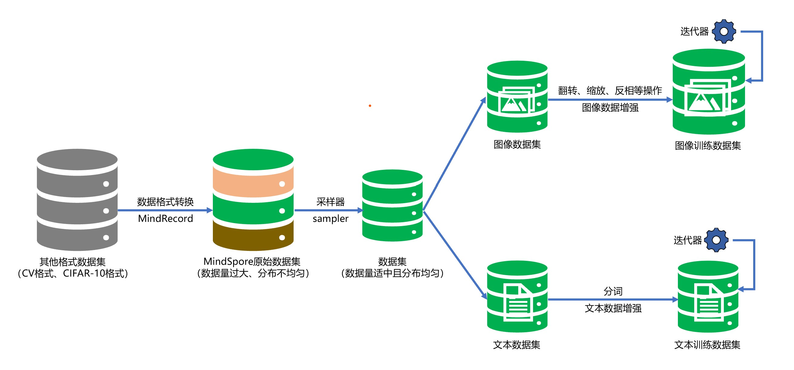

进阶数据处理
===================

 在深度学习中，良好的数据处理与增强操作对提高模型训练效果、提升模型泛化能力有重要作用。\
 初级教程的 `数据处理章节 <https://www.mindspore.cn/tutorials/zh-CN/master/beginner/dataset.html>`_ 以CIFAR-10数据集为\
 例，对数据的迭代、处理与增强操作做了简单介绍。\
 本章我们将详细介绍如何使用MindSpore对不同的数据类型进行不同方式的采样、加载、增强、迭代和格式转换操作。

.. toctree::
  :maxdepth: 1

  dataset_load_process/sampler
  dataset_load_process/load_process_common_data
  dataset_load_process/image_data_augmentation
  dataset_load_process/text_data_augmentation
  dataset_load_process/dataset_iterator
  dataset_load_process/dataset_conversion
